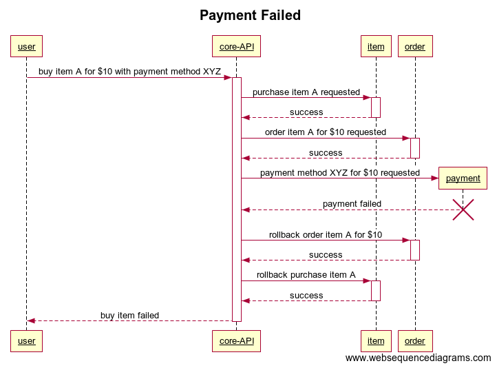

# Saga Pattern Example

A simple saga pattern example using Go and [https://github.com/lysu/go-saga](https://github.com/lysu/go-saga) library.

## Requirement

- Apache kafka (as a saga log storage)

## Command

```bash
$ go run main.go core    # run saga orceshestrator (port 8000)
$ go run main.go item    # run item service (port 8001)
$ go run main.go order   # run order service (port 8002)
$ go run main.go payment # run payment service (port 8003)
```

## Flow

Endpoint : `http://localhost:8000/normal-flow`

  

Endpoint : `http://localhost:8000/purchase-failed`

  

Endpoint : `http://localhost:8000/order-failed`

  

Endpoint : `http://localhost:8000/payment-failed`

  